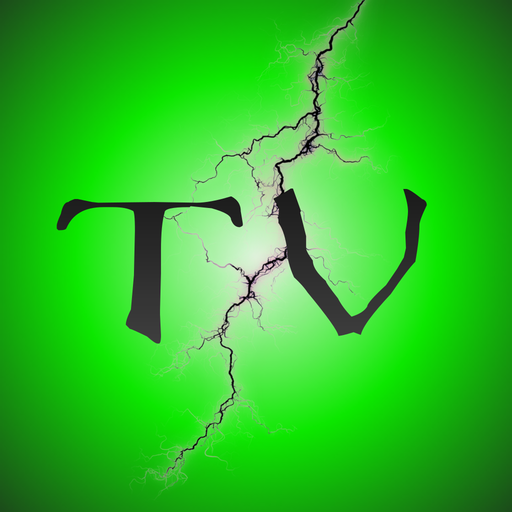
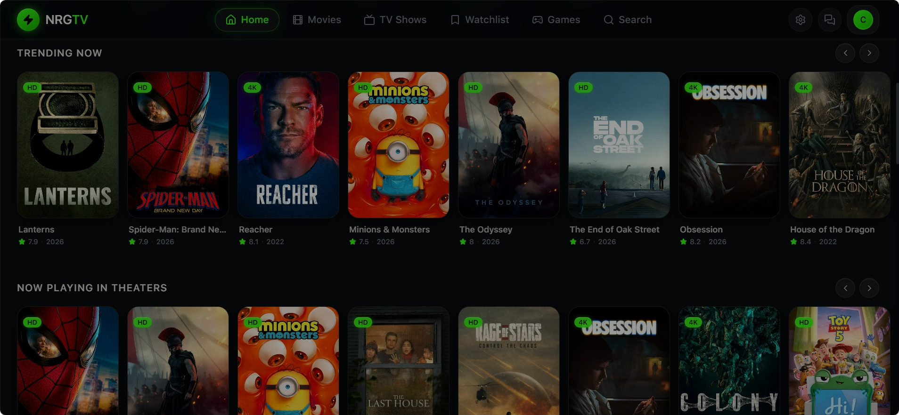

# NRGTV

**Stream movies & TV shows for free**

A homemade streaming service sourced from P2P websites — every movie, including those still in theaters. Features roll out almost daily.

 

 

## Download

| Platform | Format | Link |
|---|---|---|
| 🐧 Linux | `.deb` · `AppImage` | [Latest release →](https://github.com/NRGTV/NRGTV/releases/latest) |
| 🍎 macOS | `.dmg` · `.zip` | [Latest release →](https://github.com/NRGTV/NRGTV/releases/latest) |
| 🪟 Windows | `.exe` installer · portable | [Latest release →](https://github.com/NRGTV/NRGTV/releases/latest) |
| 🤖 Android | `APK` (sideload) | [Latest release →](https://github.com/NRGTV/NRGTV/releases/latest) |
| 🌐 Web | PWA (no install) | [Open in browser →](https://nrgtv.space) |

> **Android install:** Enable *Install unknown apps* in settings, then open the APK. Requires Android 7.0+.

---

Support: info@nrgtv.space

